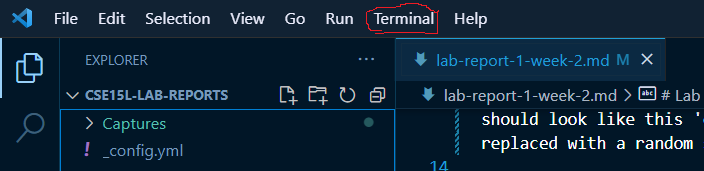
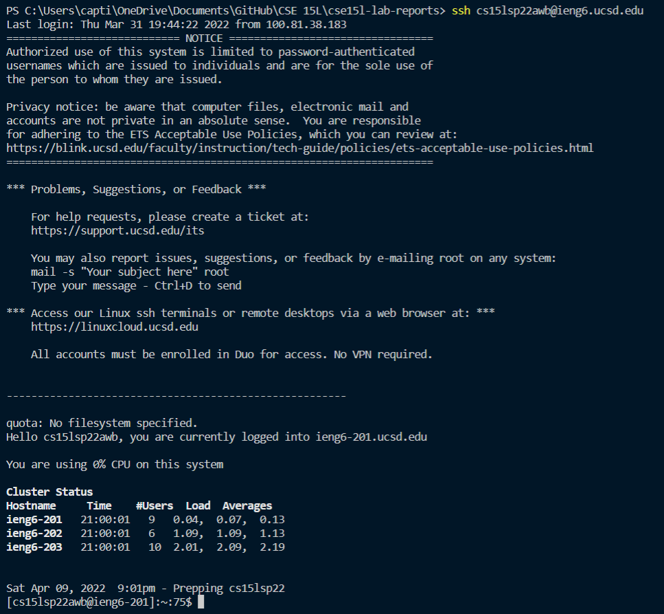
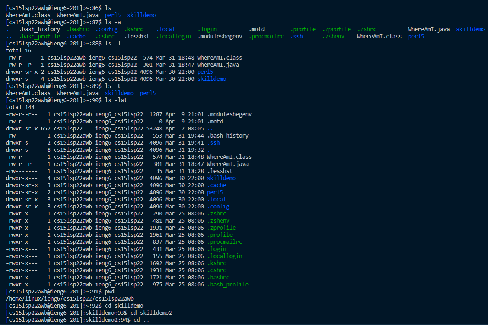
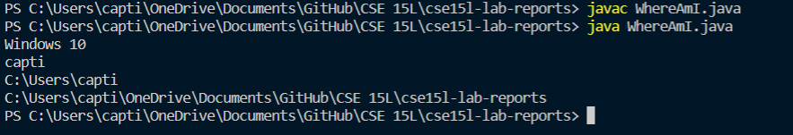
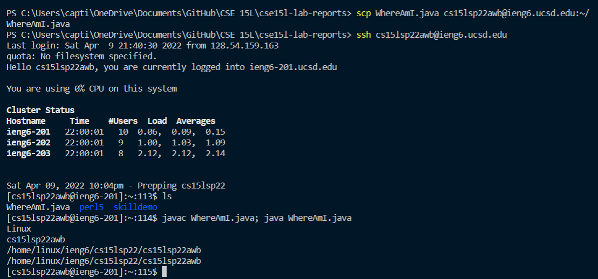
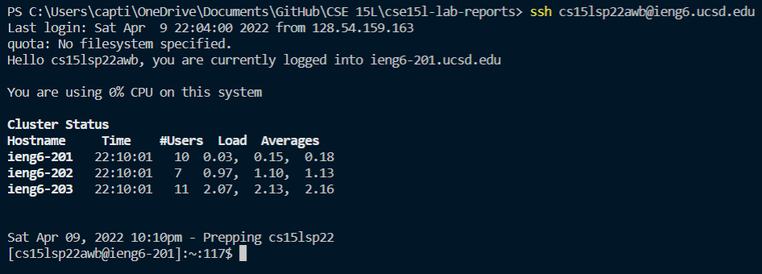
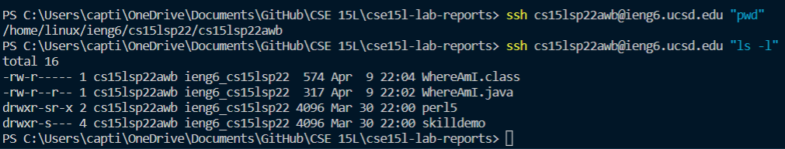
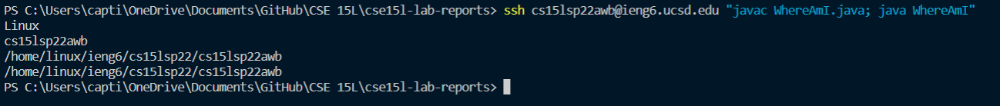

# Lab Report 1 week 2

## Installing Vs-code

1. Use this link to be taken to the website to [Install vs-code](https://code.visualstudio.com/)

2. Once you successfully installed vs-code your screen should look like this 

3. Congrats you just installed and ran vs-code

## Remote connecting

1. Before you can remotely access you first need to find out what your username is and change you password. Your username should look like this 'cs15lsp22zz' but the "zzz" should be replaced with a random set of letters.


2. You can find out what your username is and change you password by using this link. It might take 15 - 20 minutes for your password change to take effect. [Username and password](https://sdacs.ucsd.edu/cgi-bin/alloc-query) 

3. Now that you have changed you password it is now time to try to sign into your account on the server remotely. To do this open your terminal in vs-code. The terminal can be found at the top of vs-code



4. Once the terminal is open type the command 'ssh' (which stands for secure socket shell) and your username with '@ieng6.ucsd.edu' at the end. ex. 'ssh cs15lsp22zz@ieng6.ucsd.edu'. After you ssh you should be prompted for your password and if you successfully logged in then you screen should look like this.



## Trying Some Commands

1. When in the terminal there are various commands that can help. Try some commands and see what they do. Here is a list of some commands that you should try.

- ls, ls -a, ls -l, ls -t, ls -lat, pwd, cd, cd .., cd ~ , clear

2. There are plenty of other commands to try though. Here is a link for a cheat on some commands. [Linux command cheat sheet](https://linuxconfig.org/linux-commands-cheat-sheet)



## Moving Files with scp

1. For this next part we will be transfering a file from our client computer to the server. Copy this code, create a new file, and name the file WhereAmI.java

````
class WhereAmI {
    public static void main(String[] args) {
        System.out.println(System.getProperty("os.name"));
        System.out.println(System.getProperty("user.name"));
        System.out.println(System.getProperty("user.home"));
        System.out.println(System.getProperty("user.dir"));
    }
}
````

2. If you have java installed you can run this code in the terminal by using 'javac WhereAmI.java' to compile the code and 'java WhereAmI.java' to run the code. The output of this code should look similar to this.



3. Once you have you the file created you can now copy over your file to the server by using `scp` which stands for secure copy. Use this command to copy WhereAmI.java to the home directory of your account on the server: `scp WhereAmI.java cs15lsp22zzz@ieng6.ucsd.edu:~/`

4. Once you have copied the file over to the server run the code in the file again. See what is different from when you ran the code on your client computer. Your interactions on the terminal should look similar to this. 

## Setting an SSH Key

1. With the ability to `scp` to and from the client and the server it becomes cumbersome to constantly ssh and type your password to login to the server. This is where ssh-keygen comes in.
    - The idea is that keygen will create a pair of keys called private and public, you will then save the public key on the server and the private key on the client. 

2. To Create this keys, you need to type in the command `ssh-keygen`. The terminal will then ask you where you want to save these keys (the default location is fine just press enter) and for a password (just press enter for a blank password, this is recommended). Your keys are now saved in the file location of your choosing. However, if you are on windows you need to follow these extra steps. 

[Windows extra steps](https://docs.microsoft.com/en-us/windows-server/administration/openssh/openssh_keymanagement#user-key-generation)

3. Now sign into the server, we are creating a fold/directory to save the key. To do this type in `mkdir` (which stands for "make directory") and call the directory .ssh (the dot means this will become a hidden file). The command should look like this `mkdir .ssh`. You will not be able to see this directory if you use the normal `ls` you must use `ls -a` or `ls -lat` to see the .ssh directory.

4. Once you have created the .ssh folder sign out of the server and copy over the public key to the server. If you used the default location to save your keys on your pc then the command should look similar to this, if not then just make sure the path is correct. 

`scp /Users/<user-name>/.ssh/id_rsa.pub
cs15lsp22zz@ieng6.ucsd.edu:~/.ssh/authorized_keys`

5. If you have done everything correctly you should be able to sign in without having to use a password. You terminal should look similar to this. 

## Optimizing Remote Running

1. Let's wrap this up sharing a few short cuts when using the terminal.

2. You can have a command immediatly execute after and ssh command like this 

3. You can also execute multiple commands at once by using semicolons to seperate commands. 

4. And lastly and probably the most important and simplies tip is the up-arrow. By using the up/down arrows you can recall previous commands that you have run. This can help save time when having to do the same thing over and over again. 
