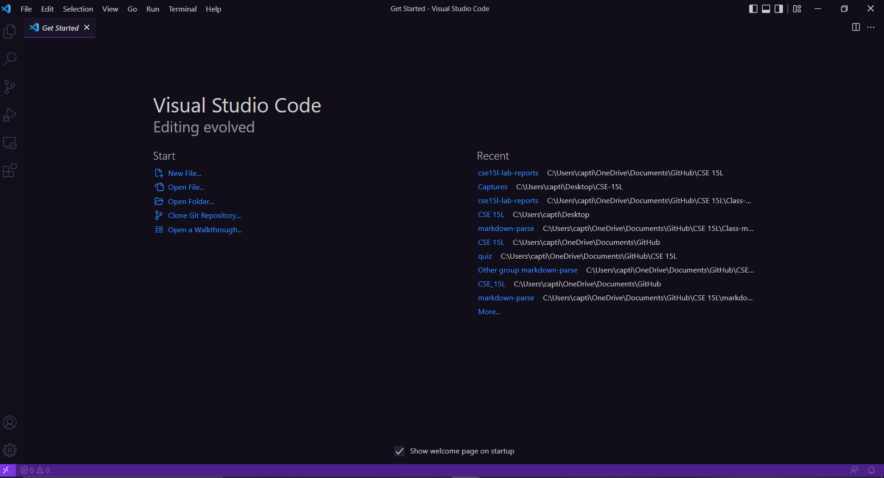
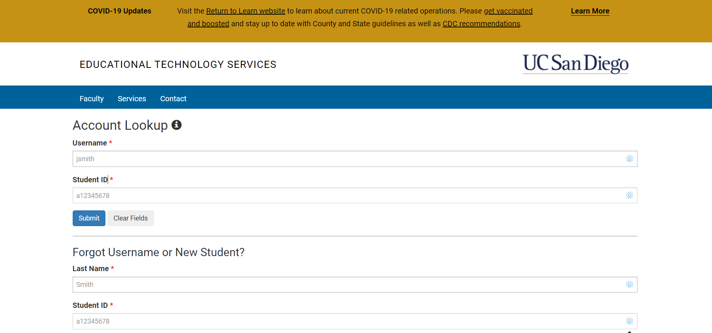

# Lab Report 1 week 2

## Installing Vs-code

1. Use this link to be taken to the website to [Install vs-code](https://code.visualstudio.com/)

2. Once you successfully install vs-code your screen should look like this 

3. Congrats you just installed and ran vs-code

## Remote connecting

- Before you can remotely access you first need to find out what your username is and change you password. Your username should look like this 'cs15lsp22zz' but the "zzz" should be replaced with a random set of letters.

- You can find out what your username is and change you password by using this link. It might take 15 - 20 minutes for your password to work. [Username and password](https://sdacs.ucsd.edu/cgi-bin/alloc-query) 

- Now that you have changed you password it is now time to try to sign into your account on the server remotely. To do this open your terminal in vs-code. The terminal can be found at the top of vs-code

- Once the terminal is open type the command 'ssh' (which stands for secure socket shell) and your username with '@ieng6.ucsd.edu' at the end. ex. 'ssh cs15lsp22zz@ieng6.ucsd.edu'. After you ssh you should be prompted for your password and if it is corrected congrats you have logged into the server.

## Trying Some Commands
## Moving Files with scp
## Setting an SSH Key
## Optimizing Remote Running