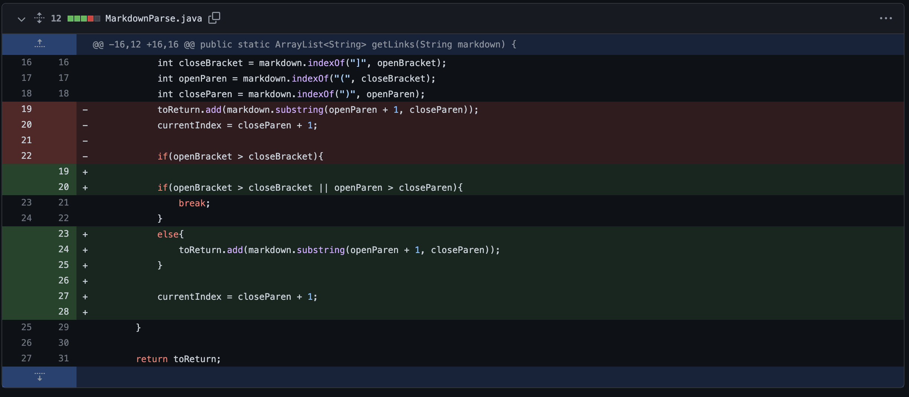

# Lab Report 2 week 4

## Code change 1


[Link to test-file1.md](https://github.com/grantcoz/markdown-parse/blob/main/test-file1.md)


### Symptom of failure-inducing input

test-file1.md causes infinite loop
````
PS C:\Users\capti\OneDrive\Documents\GitHub\CSE 15L\markdown-parse> javac MarkdownParse.java

PS C:\Users\capti\OneDrive\Documents\GitHub\CSE 15L\markdown-parse> java MarkdownParse.java test-file1.md

PS C:\Users\capti\OneDrive\Documents\GitHub\CSE 15L\markdown-parse>
````

- The infinite loop was caused by not detecting the closing bracket. This was fixed by an if-statement saying if the openBracket index was greater than the closeBracket index than skip this turn of the while loop.

## Code change 2




[Link to test-file2.md](https://github.com/grantcoz/markdown-parse/blob/main/test-file2.md)

### Symptom of failure-inducing input

test-file2.md causes exception

````
brendoncozzens@Brendons-MacBook-Pro markdown-parse % javac MarkdownParse.java
brendoncozzens@Brendons-MacBook-Pro markdown-parse % java MarkdownParse test-file2.md
Exception in thread "main" java.lang.StringIndexOutOfBoundsException: begin 3, end -1, length 3
        at java.base/java.lang.String.checkBoundsBeginEnd(String.java:4601)
        at java.base/java.lang.String.substring(String.java:2704)
        at MarkdownParse.getLinks(MarkdownParse.java:19)
        at MarkdownParse.main(MarkdownParse.java:34)
brendoncozzens@Brendons-MacBook-Pro markdown-parse %

````

- This exception was caused by not finding the closeParen. This problem was solved essential in the same way with the first code change but swapping the brackets for parentheses

## Code change 3


[Link to test-file3.md](https://github.com/grantcoz/markdown-parse/blob/main/test-file3.md)

### Symptom of failure-inducing input

test-file3.md creates out of memory exception

````
rendoncozzens@Brendons-MacBook-Pro markdown-parse % javac MarkdownParse.java
brendoncozzens@Brendons-MacBook-Pro markdown-parse % java MarkdownParse test-file3.md
Exception in thread "main" java.lang.OutOfMemoryError: Java heap space
        at java.base/java.util.Arrays.copyOf(Arrays.java:3512)
        at java.base/java.util.Arrays.copyOf(Arrays.java:3481)
        at java.base/java.util.ArrayList.grow(ArrayList.java:237)
        at java.base/java.util.ArrayList.grow(ArrayList.java:244)
        at java.base/java.util.ArrayList.add(ArrayList.java:454)
        at java.base/java.util.ArrayList.add(ArrayList.java:467)
        at MarkdownParse.getLinks(MarkdownParse.java:24)
        at MarkdownParse.main(MarkdownParse.java:38)
brendoncozzens@Brendons-MacBook-Pro markdown-parse %
````

- This exception was caused by having the parentheses and the brackets swap in the test file. This code change was solved by comparing the indexes of the parentheses and the bracket to determine which one was found first. If the parentheses were found first then the current loop would be skipped.x
