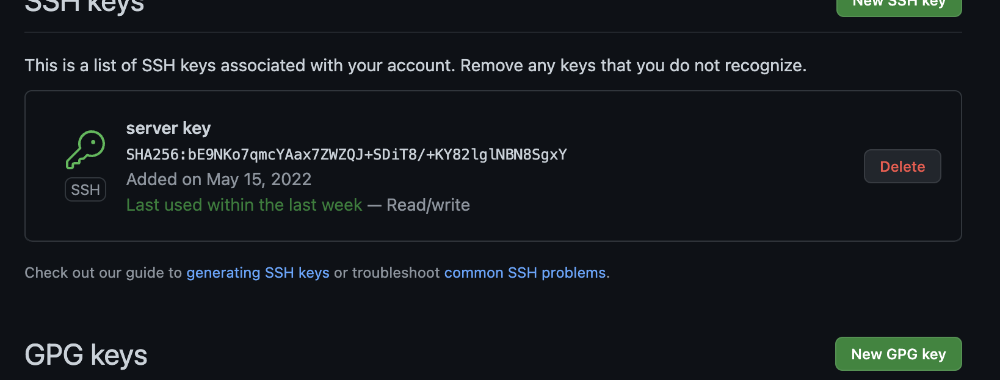
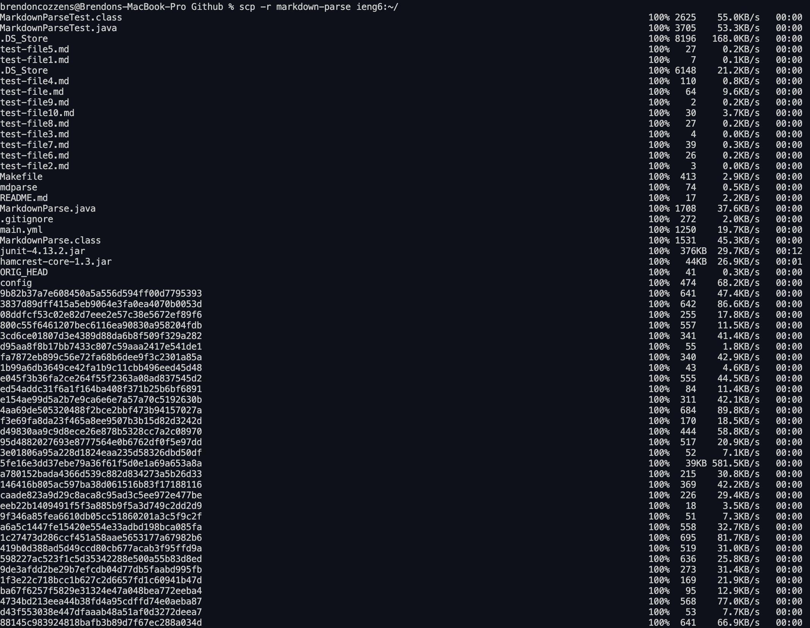

# Lab Report 3 week 6

## Task 1: Streamlining ssh Configuration

### Show your .ssh/config file, and how you edited it 


### Show the ssh command logging you into your account using just the alias you chose.


### Show an scp command copying a file to your account using just the alias you chose.


- Create a file called config in the same place where you put the ssh key. Once the file is created type
````
Host ieng6
HostName ieng6.ucsd.edu
User cs15lsp22zzz (use your username)
````

- Once this is typed in your config file, try ``ssh ieng6`` and you should be able to sign in to the server.

- Now that you can sign in try copying a file by using typing ``scp (somefile) ieng6:~/`` sign in to the remote server and your file should be there.

## Task 2: Setup Github Access from ieng6

### Show where the public key you made is stored on Github and in your user account.



### Show where the private key you made is stored on your user account as a screenshot.


### Show running git commands to commit and push a change to Github while logged into your ieng6 account.


### Show a link for the resulting commit.

[Link to commit on github](https://github.com/grantcoz/markdown-parse/commit/4bdfd0fd7b64e8066a671434c19825796f6455d6)

- I first logged into the server and cd into the .ssh directory to create my keys. However instead of using the typical `ssh-keygen`, I used 'ssh-keygen -t ed25519 -C example@gmail.com' where the email is the email you used for your github account. 

- After generating the key, type in `eval "$(ssh-agent -s)"` and you should get something like this for output `Agent pid 19842` but the number is different.

- Once that is done create a config file in the .ssh diretory and type in this

````
Host *
  AddKeysToAgent yes
  IdentityFile ~/.ssh/id_ed25519
````

- After creating and editing the config file tpye in `ssh-add ~/.ssh/config` and then type in `ssh -T github@github.com`. Once this is done you should be able to commit and push from the server. However use the ssh link from github for this to work properly

- This video really helped me with this: [Setting Up SSH Keys for GitHub](https://www.youtube.com/watch?v=8X4u9sca3Io). This step gave me a really hard time hence I felt the need to type in all of the steps.

## Copy whole directories with scp -r

### Show copying your whole markdown-parse directory to your ieng6 account.




### Show logging into your ieng6 account after doing this and compiling and running the tests for your repository.


### Show combining scp, ;, and ssh to copy the whole directory and run the tests in one line.


- To copy the directory I used the this command `scp -r markdown-parse ieng6:~/`
- To copy the directoy, ssh, compile and run on the same line was kind of a hassle. Everytime I tried just use the typical javac and java commands for the test it would give a "cannot find symbol"x error. My best guest is that my client and the server are using different versions of java so I need to specifically call the version of java on the server to compile and run the code. I also needed to compile the MarkdownParse.java file. I believe this was needed due to the MarkdownParseTest.java relies on MarkdownParse.java for it to run. Here is the command in the screenshot

````
scp -r *.java *.md lib/ ieng6:~/; ssh ieng6 "cd markdown-parse; /software/CSE/oracle-java-se-14/jdk-14.0.2/bin/javac MarkdownParse.java; /software/CSE/oracle-java-se-14/jdk-14.0.2/bin/javac -cp .:lib/junit-4.13.2.jar:lib/hamcrest-core-1.3.jar MarkdownParseTest.java; /software/CSE/oracle-java-se-14/jdk-14.0.2/bin/java -cp .:lib/junit-4.13.2.jar:lib/hamcrest-core-1.3.jar org.junit.runner.JUnitCore MarkdownParseTest"
````