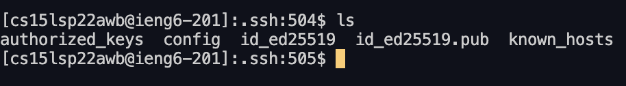
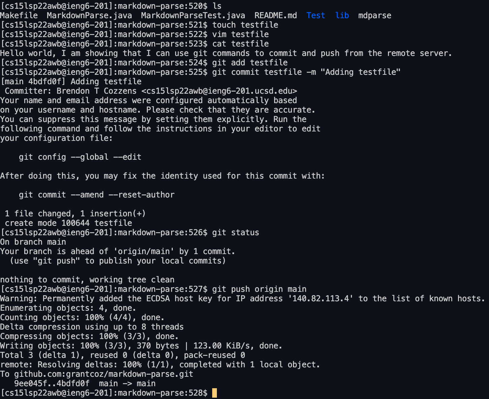

# Lab Report 3 week 6

## Streamlining ssh Configuration

### Show your .ssh/config file, and how you edited it 


### Show the ssh command logging you into your account using just the alias you chose.


### Show an scp command copying a file to your account using just the alias you chose.


- Create a file called config in the same place where you put the ssh key. Once the file is created type
````
Host ieng6
HostName ieng6.ucsd.edu
User cs15lsp22zzz (use your username)
````

- Once this is typed in your config file, try ``ssh ieng6`` and you should be able to sign in to the server.

- Now that you can sign in try copying a file by using typing ``scp (somefile) ieng6:~/`` sign in to the remote server and your file should be there.

## Setup Github Access from ieng6

 - Could not get this to work. Need help

## Group Choice 3 – Copy Whole Directories with scp -r

### Show copying your whole markdown-parse directory to your ieng6 account.


### Show logging into your ieng6 account after doing this and compiling and running the tests for your repository.



### Show (like in the last step of the first lab) combining scp, ;, and ssh to copy the whole directory and run the tests in one line.




- Having trouble. Need help. Error is in the screen shot above 