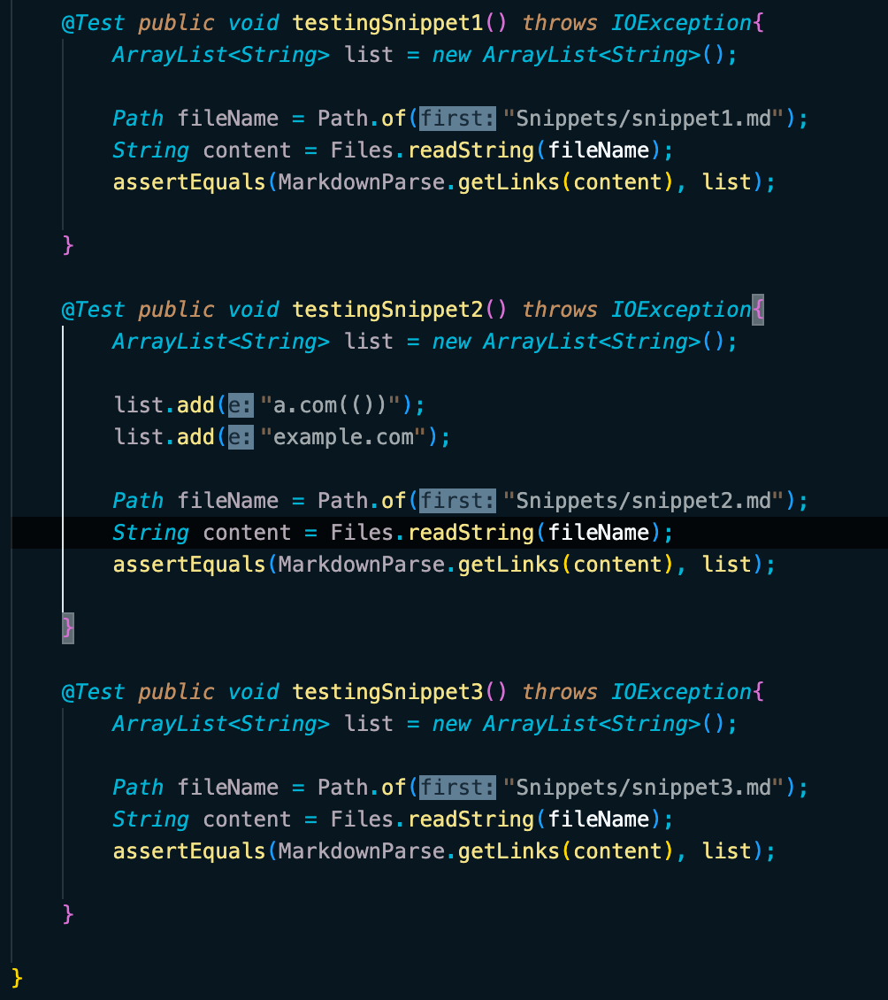
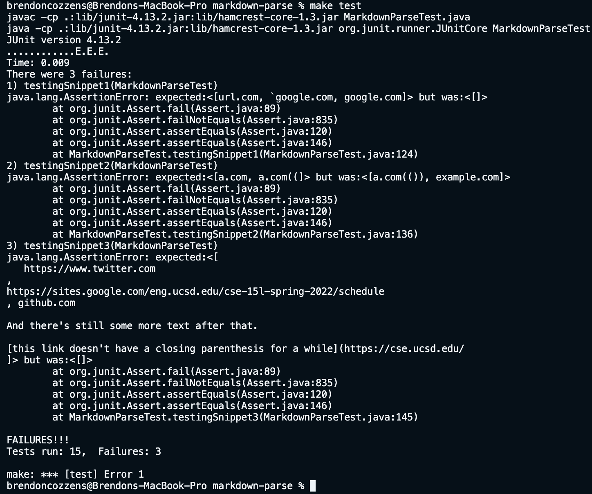
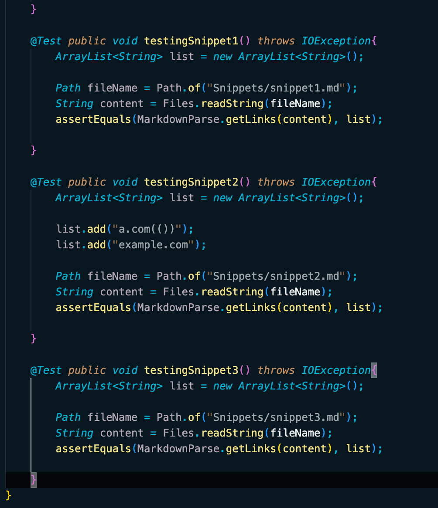
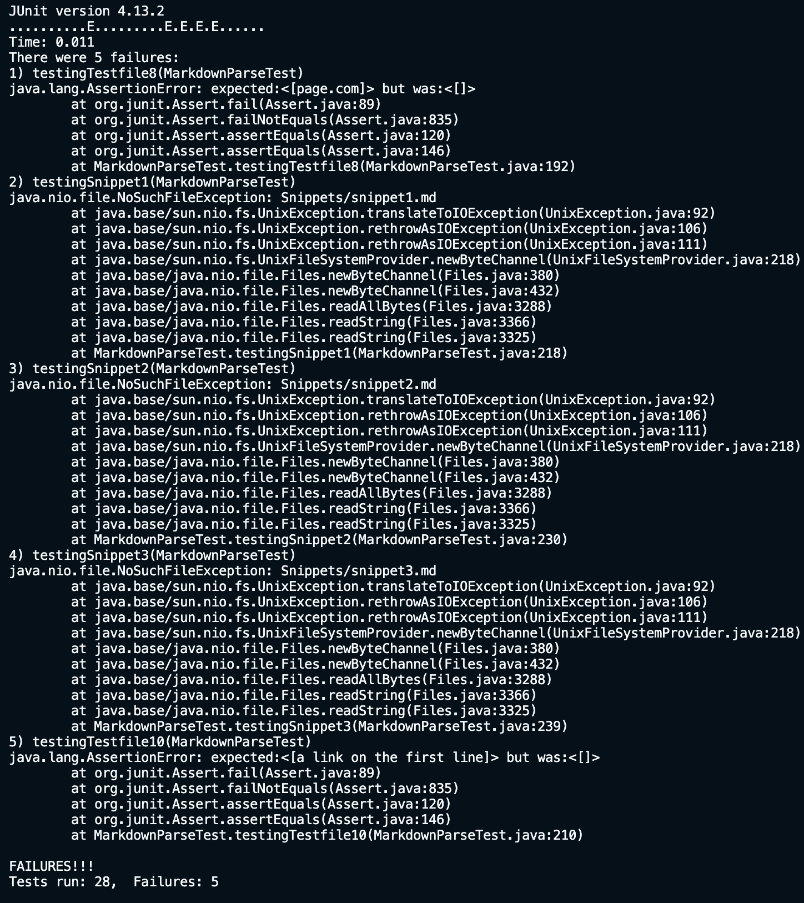

# Lab-report-4-week-8


## My Repository

- [Link to my repository](https://github.com/grantcoz/markdown-parse)

### What should the program do?

1. I believe that all of the links should return.

2. I believe that all of the links should return.

3. I believe that the third snippet should return all nothing besides an empty list.

### Picture of my tests for my repository



### Picture of the output for my repository



### Questions about each snippet

1. I this is an easy fix that could be resolved in less than 10 lines. I think the best to get about this problem is to look for an miscellaneous characters before and after the link and disregard them.

2. I this is an easy fix that could be resolved in less than 10 lines. I think that the best way to handle nested it is to make sure that the last bracket is next to the first parenthesis and the that the last parenthesis does not have any characters after it. Any other characters within the link should not matter.

3. I found this piece of code online that will work maybe. The idea is to replace newlines with an empty string and takes that empty string to the beginning of said line. While this isn't a complete fix something similar should work. 

```
String text = readFileAsString("textfile.txt");
text = text.replace("\n", "").replace("\r", "");
```

## Other Repository

- [Link to the other repository](https://github.com/kaileywong/markdown-parser)

### What should the program do?

1. I believe that all of the links should return.

2. I believe that all of the links should return.

3. I believe that the third snippet should return all nothing besides an empty list.

### Picture of my tests for the other repository



### Picture of the output for the other repository



### Questions about each snippet

1. I this is an easy fix that could be resolved in less than 10 lines. I think the best to get about this problem is to look for an miscellaneous characters before and after the link and disregard them.

2.  this is an easy fix that could be resolved in less than 10 lines. I think that the best way to handle nested it is to make sure that the last bracket is next to the first parenthesis and the that the last parenthesis does not have any characters after it. Any other characters within the link should not matter.

3. I found this piece of code online that will work maybe. The idea is to replace newlines with an empty string and takes that empty string to the beginning of said line. While this isn't a complete fix something similar should work. 

```
String text = readFileAsString("textfile.txt");
text = text.replace("\n", "").replace("\r", "");
```

