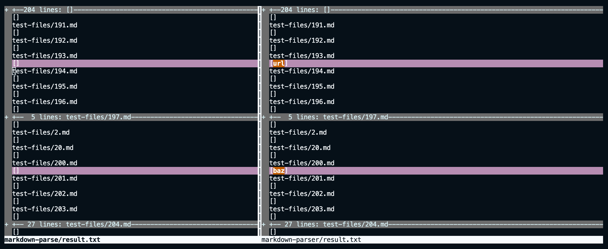

# Lab-report-5-week-10

## How you found the tests with different results?
- I found the different results via vimdiff

## Test 194

1. [Link for test 194](https://github.com/grantcoz/markdown-parse/blob/main/test-files/194.md)

2. Describe which implementation is correct, or neither if both give the wrong output.

- I believe that my implementation is correct. The file is not in the right format (i.e [something](something.com)) and therefore returned the link as empty.

3. Indicate both actual outputs and also what the expected output is.

- Actual output is given in the screenshot above when using vimdiff.

- For the expected output for test-file 194 I believe the expected output would be [my_url]. The second "link" in the file does not provide a link so therefore I am assuming the output would be empty.

4. For the implementation that’s not correct, describe the bug in about 2-3 sentences.

- The program does not check whether or not if the link is in a proper format. From what I can tell it does not compare the distance between the closing bracket and the opening parenthesis.

## Test 201

1. [Link for test 201](https://github.com/grantcoz/markdown-parse/blob/main/test-files/201.md)

2. Describe which implementation is correct, or neither if both give the wrong output.

- I believe that my implementation is correct. The file is not in the right format (i.e [something](something.com)) and therefore returned the link as empty. While the other program did return the expected output, with expection of proper format for a file the output should be returned as a empty list.

3. Indicate both actual outputs and also what the expected output is.

- Actual output is given in the screenshot above when using vimdiff.

- For the expected output for test-file 201 I believe the expected output would be [baz]. The second "link" in the file does not provide a link so therefore I am assuming the output would be empty.

4. For the implementation that’s not correct, describe the bug in about 2-3 sentences.

- The program does not check whether or not if the link is in a proper format. From what I can tell it does not compare the distance between the closing bracket and the opening parenthesis.